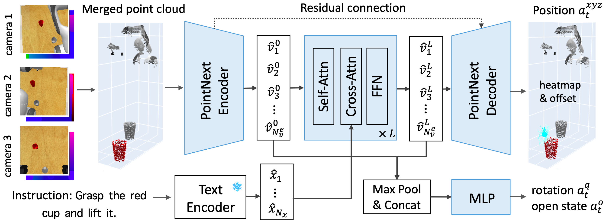

# PolarNet: 3D Point Clouds for Language-Guided Robotic Manipulation 



> [PolarNet: 3D Point Clouds for Language-Guided Robotic Manipulation](https://openreview.net/forum?id=efaE7iJ2GJv)  
> Shizhe Chen*, Ricardo Garcia*, Cordelia Schmid and Ivan Laptev  
> **CoRL 2023**  

*Equal Contribution

## Prerequisite

1. Installation

Option 1: Use our [pre-build singularity image](https://drive.google.com/file/d/1i1mNppGWhzEgrQz9G7wP7fb-0iA4mGq4/view?usp=sharing).

Option 2: Install everything from scratch.
```bash
conda create --name polarnet python=3.9
conda activate polarnet
```

See instructions in [PyRep](https://github.com/stepjam/PyRep) and [RLBench](https://github.com/stepjam/RLBench) to install RLBench simulator (with VirtualGL in headless machines). Use our modified version of [RLBench](https://github.com/rjgpinel/RLBench) to support additional tasks.

Install python packages:
```bash
conda install pytorch==1.13.0 torchvision==0.14.0 torchaudio==0.13.0 pytorch-cuda=11.7 -c pytorch -c nvidia
conda install -c huggingface transformers
conda install scipy tqdm

pip install typed-argument-parser lmdb msgpack-numpy tensorboardX 
pip install multimethod shortuuid termcolor easydict
pip install yacs jsonlines einops
```

Install Openpoints:

```bash

git submodule update --init

# install cuda
sudo apt-get remove --purge '^nvidia-.*' 
sudo apt autoremove

# blacklist nouveau: https://blog.csdn.net/threestooegs/article/details/124582963
wget https://developer.download.nvidia.com/compute/cuda/11.7.0/local_installers/cuda_11.7.0_515.43.04_linux.run
sudo sh cuda_11.7.0_515.43.04_linux.run
# If you are a user of Jean-Zay cluster run `module load cuda/11.7.1 && module load cudnn/8.5.0.96-11.7-cuda` instead

pip install open3d==0.16.0 torch-scatter
conda install pytorch-scatter -c pyg

cd openpoints/cpp/pointnet2_batch
python setup.py install --user
cd ../

cd subsampling
python setup.py build_ext --inplace
cd ..

cd pointops/
python setup.py install --user
cd ..

cd chamfer_dist
python setup.py install --user
cd ../emd
python setup.py install --user
cd ../../../
```

Finally, install polarnet using:
```bash
pip install -e .
```

2. Dataset Generation

Option 1: Use our [pre-generated datasets](https://drive.google.com/drive/folders/1WvaopPRbQYDkIf5V_bFuetwISsu2ez9E?usp=drive_link) including the keystep trajectories and instruction embeddings for the three setups studied in our paper. Using these datasets will also help reproducibility.

We recommend downloading the data using [rclone](https://rclone.org/drive/).

Option 2: generate the dataset on your own.
```bash
conda activate polarnet
seed=0
task=put_knife_on_chopping_board
variation=0
variation_count=1

cd ~/Code/polarnet/

# 1. generate microstep demonstrations
python -m polarnet.preprocess.generate.dataset_microsteps \
     --save_path data/train_dataset/microsteps/seed{seed} \
    --all_task_file polarnet/assets/all_tasks.json \
    --image_size 128,128 --renderer opengl \
    --episodes_per_task 100 \
    --tasks ${task} --variations ${variation_count} --offset ${variation} \
    --processes 1 --seed ${seed} 

# 2. generate keystep demonstrations
python -m polarnet.preprocess.generate_dataset_keysteps \
    --microstep_data_dir data/train_dataset/microsteps/seed${seed} \
    --keystep_data_dir data/train_dataset/keysteps/seed${seed} \
    --tasks ${task}

# 3. (optional) check the correctness of generated keysteps
python -m polarnet.preprocess.evaluate_dataset_keysteps \
    --microstep_data_dir data/train_dataset/microsteps/seed${seed} \
    --keystep_data_dir data/train_dataset/keysteps/seed${seed} \
     --tasks ${task}

# 4. generate instructions embeddings for the tasks
python -m polarnet.preprocess.generate_instructions \
    --encoder clip \
    --output_file data/taskvar_instrs/clip

# 5. generate preprocessed keysteps demonstrations
 python -m polarnet.preprocess.generate_pcd_dataset_keysteps \
    --seed ${seed} \
    --num_cameras 3 \
    --dataset_dir data/train_dataset/ \
    --outname keysteps_pcd \
```
For slurm users, please check scripts in `job_scripts`.

## Train

Our codes support distributed training with multiple GPUs in SLURM clusters.

For slurm users, please use the following command to launch the training script.
```bash
sbatch job_scripts/train_multitask_bc_10tasks.sh
```

For non-slurm users, please manually set the environment variables as follows.

```bash
export WORLD_SIZE=1
export MASTER_ADDR='localhost'
export MASTER_PORT=10000

export LOCAL_RANK=0 
export RANK=0
export CUDA_VISIBLE_DEVICES=0

python -m polarnet.train_models --exp-config config/10tasks.yaml
```

You can find PointNeXt pre-trained weights [here](https://drive.google.com/file/d/13qq4QPIlvJF4BwC7zEqG8vj7jcP04DBL/view?usp=drive_link).

## Evaluation

For slurm users, please use the following command to launch the evaluation script.
```bash
sbatch job_scripts/eval_test_multi10.sh
```

For non-slurm users, run the following commands to evaluate the trained model.

```bash
# set outdir to the directory of your trained model
export DISPLAY=:0.0 # in headless machines

# validation: select the best epoch
for step in {50000..200000..10000}
do
python -m polarnet.eval_models \
    --exp_config ${outdir}/logs/training_config.yaml \
    --seed 100 --num_demos 20 \
    checkpoint ${outdir}/ckpts/model_step_${step}.pt
done

# run the script to summarize the validation results
python -m polarnet.summarize_val_results --result_file ${outdir}/preds/seed100/results.jsonl

# test: use a different seed from validation
step=300000
python -m polarnet.eval_models \
    --exp_config ${outdir}/logs/training_config.yaml \
    --seed 200 --num_demos 500 \
    checkpoint ${outdir}/ckpts/model_step_${step}.pt

# run the script to summarize the testing results
python -m polarnet.summarize_tst_results --result_file ${outdir}/preds/seed200/results.jsonl
```

You can also use in the same manner `summarize_peract_official_tst_results.py` and `summarize_74_tst_results_by_groups.py` to summarize 74 tasks and peract setups results.

## Pre-trained models

Coming soon...

## BibTex

```
@article{chen23polarnet,
    author    = {Shizhe Chen and Ricardo Garcia and Cordelia Schmid and Ivan Laptev},
    title     = {PolarNet: 3D Point Clouds for Language-Guided Robotic Manipulation},
    booktitle = {Conference on Robotic Learning (CoRL)},
    year      = {2023}
}
```

## Acknowledgements

PointNeXt code from [openpoints](https://github.com/rwightman/pytorch-image-modelshttps://github.com/guochengqian/openpoints) library.


